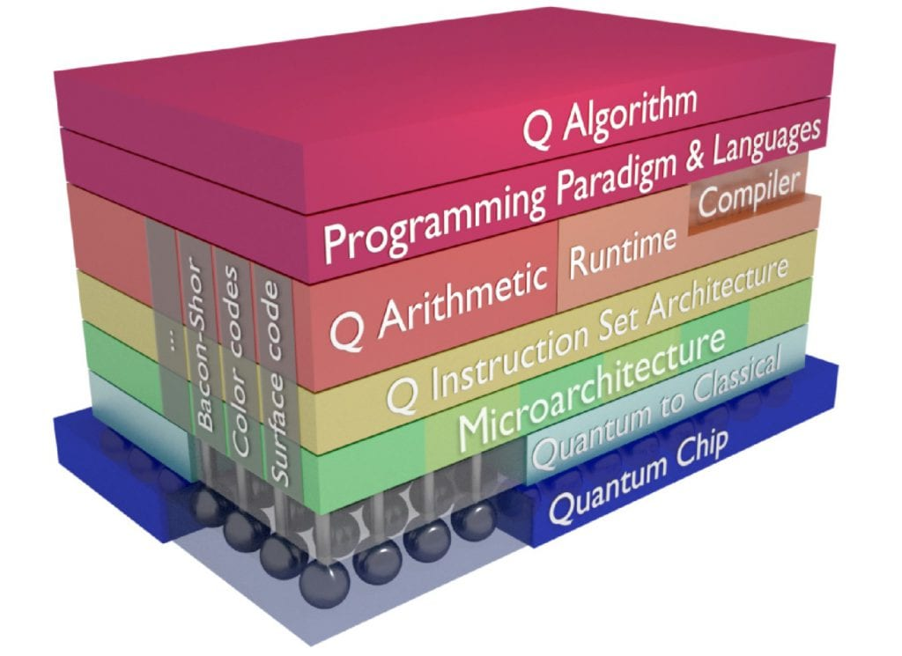

# Co-design Methodology
## 提及到的工具
SPINE: 设计以及优化量子和经典电路系统

Fig. 1. 量子计算架构

* 最底层为量子芯片
* Quantum to Classical: 测控系统，读取信号，输入控制信号

## 量子计算机性能
* qubit 本身的性能
* 读取的表现

## 协同仿真思想

将量子芯片建模为一个传统的电子芯片，不同状态的量子态下，电子芯片有不同的参数。通过经典的电路仿真来模拟测控过程。
