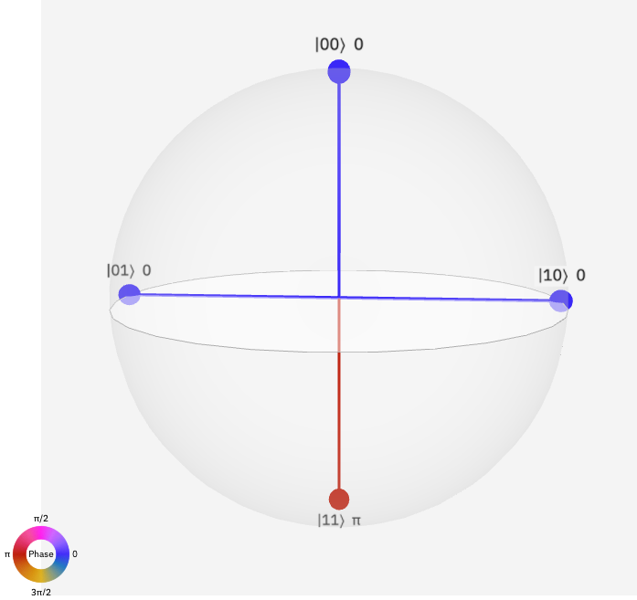

# cat qubits —— note（零散版待整理）

## 文章中的不足

* 哈密顿量 pauli Y 前系数为 $e^{-2\alpha^2}$，表明 Y error 是否还可以再降低，现在是平方，是否可以四次方
* ZZ 门，实现任意旋转角度 $\theta = 4J_{12} \alpha^2 t$ ，可以看出有很多个参数可以调，$t = 100 ns$ 还不算很快，目前量子门脉冲大都是 $40 ns$ ，可以增强耦合强度（error 会线性增加，需要同时增大 $\alpha$ 进行压制）加快 gate 操作的速度
* 物理实现比较难
* 施加控制的耦合比较难实现

## 文章中还可以优化的部分

* 进一步提升容错能力的**下界**
* 进一步降低实现通用门的 overhead
* **直接**适配其他的纠错编码（例如：**topological codes**），而不是此处的先进行 repetition code，再进行 CSS codes

---
# 文章概览

## 为什么我们要做纠错

* 实现**任意长**的通用量子计算操作
* 只要物理比特门的错误率以及执行时间**低于**某一个常数阈值，就可以做容错编码

## 现存问题
* 实现现有的量子纠错码的开销很大，在近期量子设备上实现不太现实
* 如果要在**任意**的量子计算机（各种噪声都考虑进去）上实现**任意长时间**的通用量子计算，做容错能力强的纠错码需要极其大的物理 qubits and gates 的开销
## 现有方案
* 系统的噪声通道是**非对称（asymmetric）** 的或者明显**偏置（biased）** 到某一通道，这样使得纠错能力下界更高（只需要抑制部分主要的噪声，纠错效果更好）
* 现有方案的不足：**仅仅在逻辑比特层面**（假设无噪音的物理电路）提出的适用于 **biased noise** 的 **surface code** 理论上有很强的纠错能力，但是考虑到真实电路层面的噪声时，因为门操作往往与偏置的噪声通道不对易（例如：在主要 Z 通道噪声的系统中实现 X 操作，纠错码主要抑制 Z 通道错误，X 操作就相当于没有被保护），这些优势不一定能保持
* 实现保持偏置的 **CX** 门在通常的严格二能级系统中是**不可能**的，而 CX 门又是实现 **stabilizer code** 的一个重要的组成部分，所以传统二能级系统无法实现这种完整的 **bias-preserving** 的通用逻辑门操作集合（例如：在传统二能级系统中，处于Z通道偏置下，是**无法**只在Z通道进行操作实现CX门）
## 要解决的问题
* 只在 **一种偏置通道下**实现一组**通用逻辑门的集合**，这样的话只需要抑制一种噪声就可以实现通用量子计算，降低纠错的门槛，提升纠错的能力
## 本文方案
* 在驱动非线性谐振器（例如：**克尔非线性谐振腔**）中实现**猫态比特**，并利用猫态比特实现 **bias-preserving** 的通用逻辑门集合（这里的难点是实现CX门，因为其他的门操作都可以很轻松的在Z通道实现）
* <strong>优势</strong>:
    * 猫态比特的主要偏置噪音是 **phase-flip**，随着 **cat size** 的增大噪音线性增长
    * **bit-flip** 噪声会随着 **cat size** 增长被指数级压制
* 本文是通过猫态比特在 **phase space** 中的 **rotation** 引入的 **topological phase** 来实现 **CX** 门，所以 CX 门主要被 **phase-flip** 所影响
* 利用适用于此种 **biased-noise** 的容错编码来进行纠错，可以提升纠错能力，并且降低开销（因为只需要对一种主要的噪声进行抑制）
## 本文主要结果
* 实现了 bias-preserving 的 CX 门（**mean photon number** of cat qubits < **10**）
* 将容错能力的下界提升了两倍，将实现 Clifford operations（一种重要的量子门操作） 的开销降低了五倍
[Clifford gates 介绍](https://en.wikipedia.org/wiki/Clifford_gates)
注：简要来说实现 Clifford operations 就是要实现三种门 { Hadmard, **CNOT**(is **CX**), S }

---

# 本文亮点

1. 现在大多数的纠错研究都是考虑的具有一般噪声的系统，在 depolarizing noise model 中，噪声出现在 X, Y, Z 通道是随机的，所以，认为每种噪声具有均匀的分布，出现的概率相同。在进行噪音抑制时，每种噪声都要等同的考虑进去。
2. 本文考虑到很多物理系统的噪声并不是对称的，在有些系统中，某种类型的噪声是占据**主导地位**的。（例如：fluxonium、quantum-dot spin qubits、nuclear spins in diamond）。
3. 在这些具有不对称的噪音结构的系统中，进行纠错编码就只需要对主要的几个噪声类型重点抑制，实现更优的纠错能力和低的开销。

# Bias-preserving gate 举例说明（以Z通道噪音偏置为例）

### 1. ZZ gate

* ZZ gate 定义
  * $$ZZ(\theta) = e^{i\theta \hat Z_1 \hat Z_2 / 2 }$$
  * 表示在两个 qubits 的 tensor product 空间的 Q sphere（单比特空间叫 bloch 球，多比特直接空间在球面上的量子态表示叫 Q sphere）上绕着 ZZ 轴旋转 $\theta$ 角
    * [Q sphere 定义](https://quantum-computing.ibm.com/composer/docs/iqx/visualizations#q-sphere-view)
    * 全 0 的态定义为 Q sphere 的北极（例如：$\left | 000 \right \rangle$）
    * 0 的个数相同的态定义在同一个纬度的等分节点上（例如：$\left | 001 \right \rangle, \, \left | 010 \right \rangle , \, \left |100 \right \rangle$​）
    * 从北极开始到南极之间的每一个纬度，量子态中 1 的个数逐渐增加，直到南极为 $\left | 111 \right \rangle$
    * 球面上的点的颜色代表该量子态的相位

Fig. 1. Diagram of Q-Sphere

* ZZ gate 的实现

  * 哈密顿量：$\hat H_{ZZ} = -V\hat Z_1 \hat Z_2$ (这里，V是两个比特之间的耦合强度)
  * 体系演化算符：$U_{ZZ}(t) = e^{-i \hat H t} = e^{iV\hat Z_1 \hat Z_2 t}$
  * 要实现旋转 $\theta$ 角度：$U_{ZZ}(T) = e^{iV\hat Z_1 \hat Z_2 T} = e^{i\theta \hat Z_1 \hat Z_2 / 2 } \Longrightarrow T = \frac{\theta}{2V}$​

* 含有 Z 通道噪音的 ZZ gate（噪音造成的 phase-flip 错误发生在时刻 $\tau$（$0< \tau <T$​））

  * 含有噪音的体系演化算符：$U_{ZZ}^{error} = U_{ZZ}(T-\tau)\hat Z_{(1\, or\, 2)} U_{ZZ}(\tau)$​ ( phase-flip 发生在比特 1 或者比特 2 上 )

  * 因为 $\hat Z$ 与 $U_{ZZ}$ 对易，所以算符之间可以交换顺序，体系演化算符可以变为

    $$ U_{ZZ}^{error}=\hat Z_{(1 \, or\, 2)}U_{ZZ}(T-\tau)U_{ZZ}(\tau) = \hat Z_{(1 \, or\, 2)}U_{ZZ}(T) $$

  * 这种错误并没有改变整体演化的结构，只是相当于在正确的操作执行完后，又加上了一个额外的相位，这种错误可以较容易的被纠错编码所纠正

### 2. CX gate

* CX 门定义：

  * 名词解释：CX 里的 C 就指的是 Control，X 就指的是 X 门，CX门我们经常称其为 `控制非门` （因为 X 门的作用就是比特反转，相当于 NOT 门<非门>，所有其又称为 `CNOT` 门）

  * 简明表述：有两个 qubit，一个称之为 Q1，另外一个称之为 Q2，我们将 Q1 作为控制比特（Control），将 Q2 称之为目标比特（Target）。

    Q1 作为控制比特，他的作用为：

    a. 当它自己（Q1）的量子态是 $\left | 0 \right \rangle$​ 时，对目标比特（Q2）不进行任何操作（相当于对 Q2 施加一个平庸的单位算符 $I$​）

    b. 当 Q1 的量子态是 $\left | 1 \right \rangle$ 时，对 Q2 进行 X 操作（相当于将 Q2 的量子态反转: $\left | 0 \right \rangle \lrarr \left | 1 \right \rangle$ ）

    所以 CX 门被称为控制非门，Q1 会控制 Q2 是否进行反转操作

  * 意义：CX 门是量子计算中特有的门操作，实现此功能需要利用到两比特间的量子纠缠

* 物理实现：

  * CX 门：$CX = \left(\frac{I_1+Z_1}{2}\otimes I_2\right)+\left(\frac{I_1-Z_1}{2}\otimes X_2\right)$​

  * 哈密顿量：$\hat H_{CX} = -V[\left(\frac{I_1+Z_1}{2}\otimes I_2\right)+\left(\frac{I_1-Z_1}{2}\otimes X_2\right)]$​​​

  * 时间演化算符：$U(t) = e^{-i\hat H t} = e^{iV\left[\left(\frac{I_1+Z_1}{2}\otimes I_2\right)+\left(\frac{I_1-Z_1}{2}\otimes X_2\right)\right]t}$​​​

  * 实现CX 门：$U_{CX}(T) = e^{iV\left[\left(\frac{I_1+Z_1}{2}\otimes I_2\right)+\left(\frac{I_1-Z_1}{2}\otimes X_2\right)\right]T}=CX$​​

    利用公式：$e^{i\theta\hat A}=cos(\theta)I+isin(\theta) \hat A$​​​

    可得：$U_{CX}(T)=cos(VT)I - isin(VT)CX=CX \Longrightarrow VT=\frac{\pi}{2}$​​

* 含有噪音的 CX 门（设噪音造成的 phase-flip 错误发生在目标比特（Q2）上，时刻 $\tau$​（$0< \tau <T$​​））

  * 演化算符：(还不会推导这一步)

    $$\begin{align*}U_{CX}^{error}(T) &= U_{CX}(T-\tau) (\hat I_1 \otimes \hat Z_{2}) U_{CX}(\tau) \\&=\hat I_1 \otimes \hat Z_2 \,e^{iV(T-\tau)(\hat I_1 - \hat Z_1) \otimes X_2} U(T)\end{align*}$$​

* 噪音分析：
  * 当 target qubit 发生 phase-flip ($\hat Z_2$)时，control qubit 也会发生 phase-flip 错误 ($\hat Z_1$)
  * 演化完后等效的结果是 target qubit 既有 phase-flip，也有 bit-flip 错误（$\hat X_2$）
  * 门操作（V，T）的不确定性（涨落）也会引起控制错误，引起 bit-flip 错误
  * 执行CX 门发生的错误在最后没有保持偏置在 Z 通道
  * 在严格的二能级系统中，native bias-preserving CX 门是不存在的

# 本文方案简介

## 物理系统：参量驱动非线性谐振腔（parametrically driven nonlinear oscillator）
### Kerr nonlinear resonator (KNR)

Fig. 2. Scheme of the nonlinear resonator
如 Fig. 2 所示，非线性谐振腔是在一段 $\lambda/2$ 波导谐振腔中插入一个非线性的约瑟夫森结所构成的，波导腔与传输线以 $C_c$ 电容耦合，用作信号读取（读取反射信号 $out$），阻抗匹配为 $50\Omega$（保证没有杂波）。

### 等效电路模型

Fig. 3. Equivalent circuit of the nonlinear resonator
将 Fig. 2 转化为如 Fig. 3 所示的等效电路模型，求解系统哈密顿量

#### 系统哈密顿量
$$
H = \frac{\phi_1^2}{2L_e} - E_J \mathrm{cos} \left ( \frac{\phi -\phi_1}{\phi_0}   \right ) + \frac{q^2}{2C_e}
$$
其中 $\phi_0 = \hbar/2e$ 为**约化磁通量子**

### 物理比特：2-component cat qubits

* $\left| C_\alpha^{\pm} \right\rangle=N_{\pm}(\left|\alpha\right\rangle \pm \left|-\alpha\right\rangle)$

* $\left \langle C_\alpha^\pm | C_{-\alpha}^\pm \right \rangle=0$
* $N_\pm = 1/ \sqrt{2(1\pm e^{-2|\alpha|^2})}$

### 逻辑比特：

* X-axis：$| \pm \rangle = |C_\alpha^{\pm}\rangle$

* Z-axis：

  $$\begin{align*}|0\rangle = \frac{|+\rangle+|-\rangle}{\sqrt2} = \frac{|C_\alpha^+\rangle+|C_\alpha^-\rangle}{\sqrt2}\\ |1\rangle = \frac{|+\rangle-|-\rangle}{\sqrt2} = \frac{|C_\alpha^+\rangle-|C_\alpha^-\rangle}{\sqrt2}\end{align*}$$

  For larger $\alpha$，$N_\pm \approx 1/\sqrt2$

  $$\begin{align*} &|0\rangle \approx |\alpha \rangle \\ &|1\rangle \approx |-\alpha \rangle\end{align*}$$​

### 与 harmonic oscillator 对比

* Cat qubits 是简并态
* 可以实现更快的门操作
* Phase-flip 随着 $\alpha$ 的增大而线性增长，bit-flip 随着 $\alpha$ 的增大被指数级压制
* 该系统有 biased-noise channel：phase error channel（Z）
* 通过改变参量驱动的 phase，利用在 phase space 的旋转实现 topological phase，可以构造 bias-preserving CX 门
* 门操作（主要是改变相位）的控制错误也是 biased-preserving 的

## 本文主要内容

- cat qubits 的**制备**（我们可以使用 **shortcuts** 制备）
- ZZ 门的实现，ZZ 门可以用来降低在进行 magic state distillation 时的开销
- **biased-preserving CX** 门的实现
- 在此系统的一组通用量子门集合下实现纠错：**repetition code**(主要抑制 **phase errors**) $\longrightarrow$​​ **CSS code**(主要应对剩下的 **symmetric noise**)
- biased-preserving CX 门使得纠错的 threshold 提升了**两倍**，同时使得 repetition gadgets 的开销降低了 **5 倍**

## 参考文献
[1]